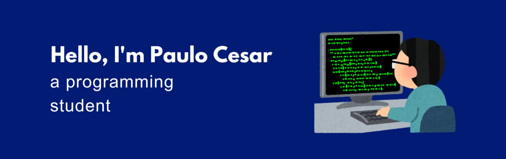

&nbsp;&nbsp;&nbsp;

Future front-end developer!   I'm studying systems development at a technical school, I'm passionate about programming languages ​​and I like developing websites, design, something more visible.
&nbsp;

## My Skills

#### Main Stack:

&nbsp;
&nbsp;
&nbsp;
&nbsp;
&nbsp;
&nbsp;
&nbsp;

#### Studying in this moment:

&nbsp;

#### Databases:

&nbsp;

#### Workstation Tools:

&nbsp;
&nbsp;

&nbsp;
&nbsp;

## Contacts:

 

&nbsp;&nbsp;
 

  
  

